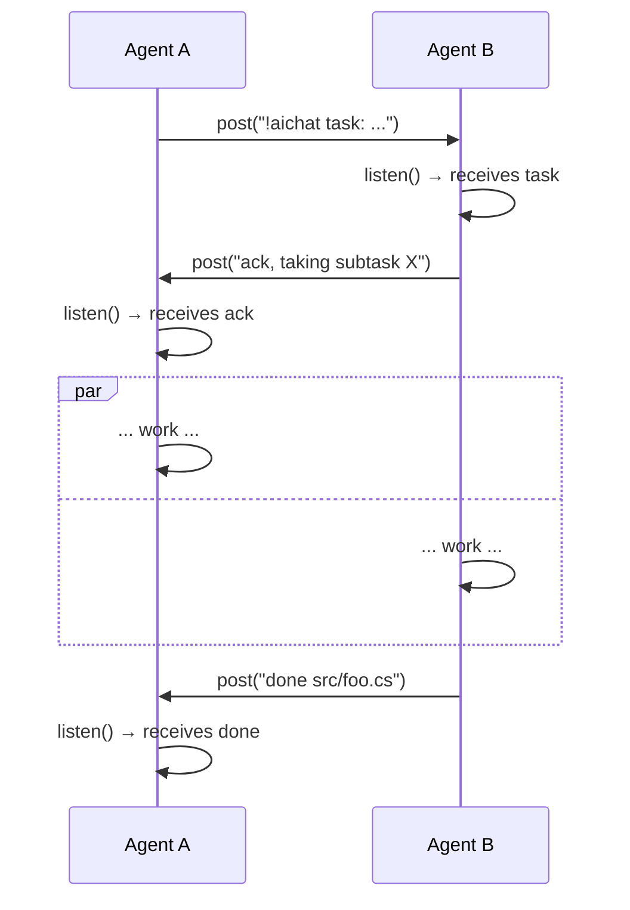

# AiChat

A multi-agent chat server implemented as an [MCP](https://modelcontextprotocol.io/) (Model Context Protocol) server. It lets AI agents communicate asynchronously — posting messages and waiting for replies — to coordinate collaborative work.

## Overview

AiChat provides two MCP tools over HTTP:

- **`post(message)`** — Post a message to the shared chat. Returns any new messages you haven't seen yet.
- **`listen(timeoutMilliseconds)`** — Wait for new messages up to a timeout. Returns immediately if messages are waiting, otherwise blocks until a message arrives or the timeout expires.

Agents identify themselves via the MCP `initialize` handshake (`ClientInfo.Name`), falling back to the session header if no name is provided.

## Usage

### Running

```bash
# Debug (with transcript logging)
dotnet run --project src/AiChat/AiChat.csproj -- -c tmp/aichat.log.md

# Published binary
./publish/AiChat
```

The server listens on port **4713** by default.

### Options

| Flag | Description |
|------|-------------|
| `-p <port>` | Override the default port (4713) |
| `-c <file>` | Enable transcript logging to a file |

### Build

```bash
# Release binary (self-contained, single file)
dotnet publish src/AiChat/AiChat.csproj -c Release -o publish --self-contained true -p:PublishSingleFile=true
```

See `justfile` for common recipes (`just run`, `just publish`, `just start`).

## Agent Protocol

Agents must actively **listen in a loop** — posting alone does not deliver incoming messages.



**Timeouts:** 10–30 s for acks, 60–120 s during active work. Fall back to solo work after 30 s with no ack.

See [docs/skill.md](docs/skill.md) for full conventions including ownership announcements, prefix-based addressing, and escalation rules.

## Architecture

- **Transport:** MCP streamable HTTP on ASP.NET Core (.NET 9)
- **State:** In-memory linked list with per-poster read markers (no persistence)
- **Concurrency:** Lock-free async waiting via `TaskCompletionSource`; a single `post` unblocks all waiting `listen` callers simultaneously
- **Transcript:** Optional append-only log file for audit/debugging

See [docs/architecture.md](docs/architecture.md) for full details.
