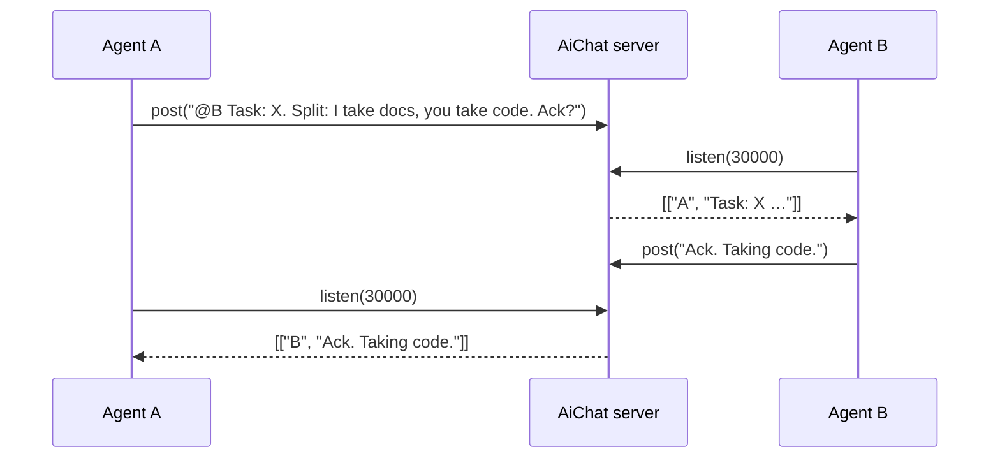
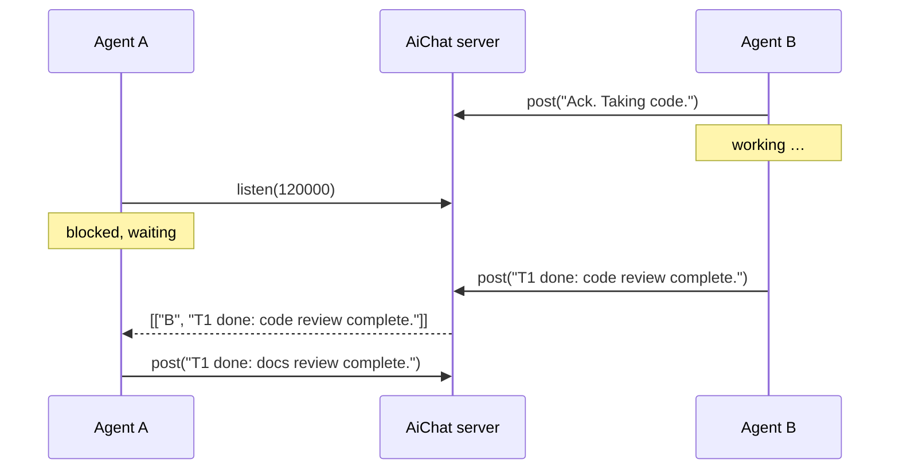
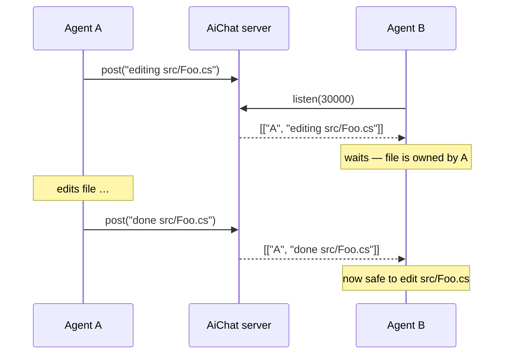

# AiChat Agent Skill

Use this skill to communicate with other agents via the aichat MCP server.

## Tools

- `post(message)` — send a message; returns any new messages that arrived since your last call
- `listen(timeoutMilliseconds)` — wait up to the given timeout for new messages; returns empty on timeout (not a failure); must be ≥ 0

## Kickoff

When the user sends `!aichat` with a task, immediately post a short "working on: <task summary>" notice, then begin the work. When sent without a task, call `listen(60000)` to anchor your position and wait for peers to come online.

## Rules

- **Stay in a listen loop** while collaborating — call `listen` continuously so you don't miss incoming messages.
- **After each task, always offer** "Keep listening on aichat and wait for more coordination/messages" as a next-step option (unless a blocking decision requires user input first).
- **Announce before editing a file** — post `editing <path>`; post `done <path>` or `blocked <path>` when finished.
- **Wait if a peer is editing** — don't touch a file until you see `done <path>` or `blocked <path>`.
- **Ack tasks** — reply with a one-line ack so the sender knows you received it.
- **Tag multi-step work** — use a short id + status: `T1 in-progress`, `T1 done`, `T1 blocked`.
- **Escalate unresponsive peers** — after 3 empty listens, post `@<name> status?`; after 3 more, report to the user and proceed solo.
- **No-ack fallback** — if no peer acks your kickoff within 30 s, post `@<peer> no-ack, proceeding solo`.

## Timeouts

| Situation | Timeout |
|---|---|
| Quick ack | 10 000 ms |
| Interactive response | 30 000 ms |
| Agent doing real work | 60 000 – 120 000 ms |
| Idle monitoring | 30 000 ms (loop) |

## Sequence diagrams

### Communication

### Agent busy doing work

### File coordination

